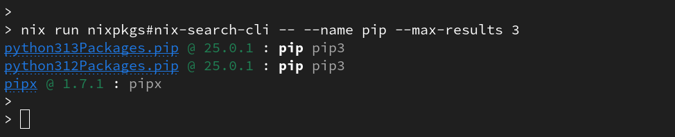
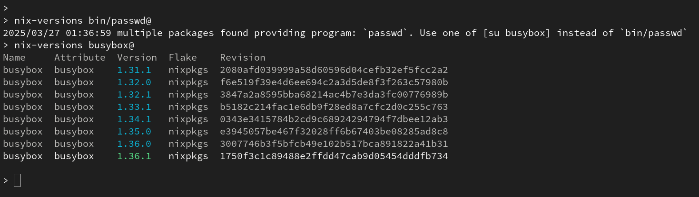
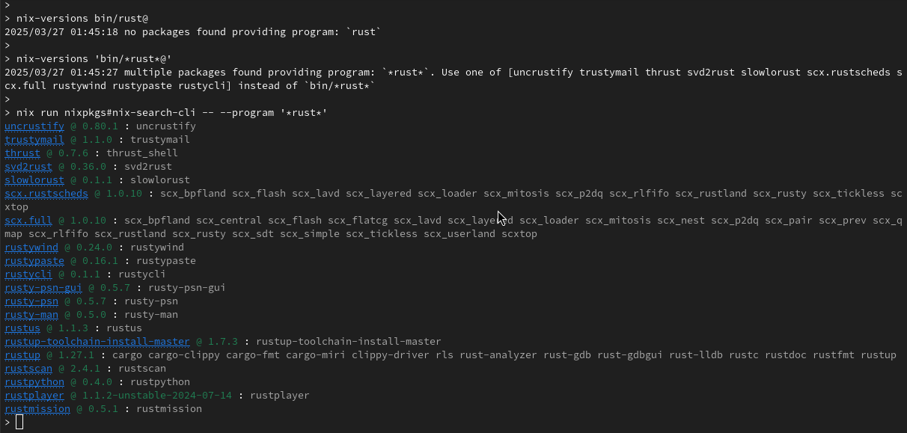

______________________________________________________________________

## layout: doc outline: 1 title: Finding packages prev: text: Listing package versions link: /listing-versions next: text: Foo link: '/foo'

# Finding packages - nixpkgs attribute-paths.

You can think of the nixpkgs collection as a very-very-huge tree of json-like objects (but implemented in the nix-language). Installable packages are part of that nixpkgs tree. And even when most of the installable programs have pretty much guessable names, like: `emacs`, `ruby`, `go`, `cargo`, `zig`, `nodejs`, some others like `pip` are accessible under a nested attribute-path, like `python312Packages.pip`. This is because sometimes a package is tied to a particular version of their runtime or simply organized as part of a particular package set, eg, there's also `rubyPackages_3_1` upto `rubyPackages_3_4`, it pretty much depends on how the awesome people maintaining those packages decide to organize that huge tree of >200_000 packages.

`nix-versions` is only possible thanks to the awesome people that have built indexes and APIs available for searching packages and their versions. And tries to make the best of them for you.

# Search Backends

Currently, `nix-versions` connects to the following backends:

- [search.nixos.org](https://search.nixos.org) - This is the Official NixOS website to search for packages. Most people use it via ther web interface, but thanks to [nix-search-cli](https://github.com/peterldowns/nix-search-cli) we can query their ElasticSearch indexes for finding packages by name or provided programs (more on this bellow).

- [Lazamar index](https://lazamar.co.uk/nix-versions/) - Thanks to Lazamar, people can search historical versions of packages by channel. (You can think of a nixpkgs channel as a particular branch, eg `nixpkgs-unstable` or a particular release `nixos-24.05`, see their website for available channels.)

- [NixHub API](https://www.nixhub.io/) - The nice guys at [Jetify](https://www.jetify.com/) built this versions index for their wesome [devbox](https://www.jetify.com/devbox) product. And kindly have provided a public [API](https://www.jetify.com/docs/nixhub/).

Both Lazamar and NixHub can be used by `nix-versions` when searching for historical versions. By default, we use NixHub since it seems to be updated more frequently.

However each package spec can specify the backend used for it, and you can also change the default for those specs not specifying a particular backend with the `--nixhub` and `--lazamar` options. (read bellow)

# Finding by name / description / meta-data.

As stated above, the amazing [nix-search-cli](https://github.com/peterldowns/nix-search-cli) tool can be used from the terminal to query on [search.nixos.org](https://search.nixos.org).

```shell
# Search programs whose name matches pip
nix run nixpkgs#nix-search-cli -- --name pip --max-results 3
```

::: details see command output

:::

See `nix-search-cli --help` for more advanced examples.

# Finding by provided program.

This is a feature we have borrowed from `nix-search-cli`, since it might be useful to search directly by the name of a provided program.

```shell
# Packages that provide a program named exactly `passwd`
nix-versions bin/passwd@
```

::: details see command output

:::

```shell
# Packages containing rust on their program name.
nix-versions 'bin/*rust*@'
```

::: details see command output

:::

For most cases we recommend using `nix-search-cli` for finding the correct attribute-path of some package you need. It even lets you filter by license and other metadata, see the examples on their readme.

# Finding versions on a particular nixpkgs channel.

Exmpalin this

```shell
nix-versions lazamar:nixos-21.05:emacs@ lazamar:nixos-23.05:emacs@ lazamar:nixpkgs-unstable:emacs@ --one
```

::: details see command output

:::

# Setting default versions backend

```shell
nix-versions --lazamar emacs@ --one
nix-versions --nixhub  emacs@ --one
nix-versions lazamar:emacs@ nixhub:emacs@ --one
```

::: details see command output

:::
